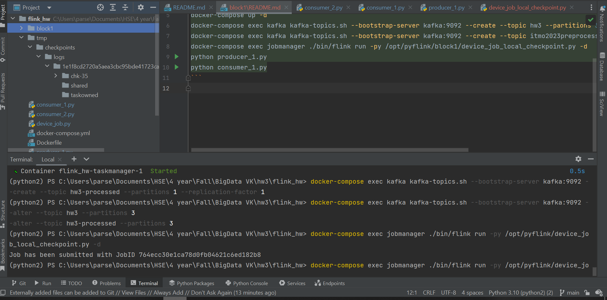
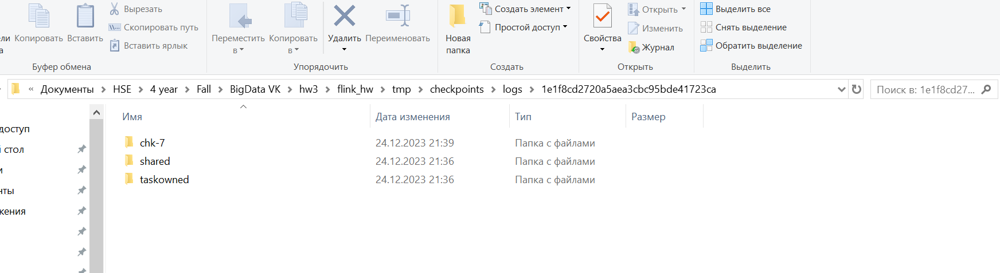
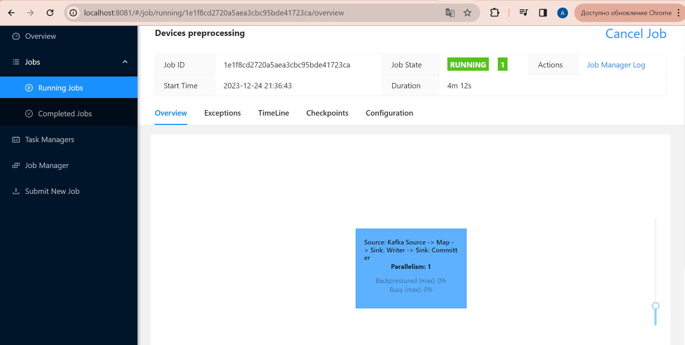
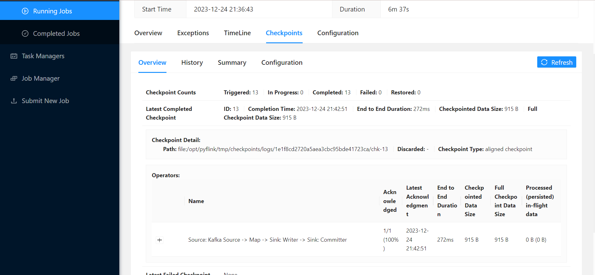

## Configure Flink checkpoint and save to local dir `file:///opt/public/tmp/checkpoints/logs` to provide recovery mechanism

```commandline
docker-compose build 
docker-compose up -d 
docker-compose exec kafka kafka-topics.sh --bootstrap-server kafka:9092 --create --topic hw3 --partitions 3 --replication-factor 1
docker-compose exec kafka kafka-topics.sh --bootstrap-server kafka:9092 --create --topic hw3preprocessed --partitions 3 --replication-factor 1
docker-compose exec jobmanager ./bin/flink run -py /opt/pyflink/block1/device_job_local_checkpoint.py -d
python producer_1.py
python consumer_1.py
```



