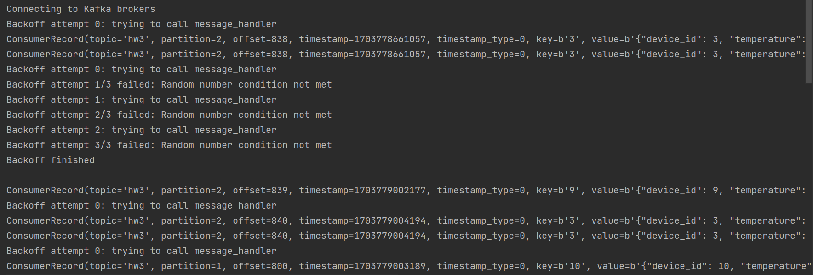

##  backoff for kafka consumer using decorator

```commandline
docker-compose build 
docker-compose up -d 
docker-compose exec kafka kafka-topics.sh --bootstrap-server kafka:9092 --create --topic hw3 --partitions 3 --replication-factor 1
docker-compose exec kafka kafka-topics.sh --bootstrap-server kafka:9092 --create --topic hw3preprocessed --partitions 3 --replication-factor 1
docker-compose exec jobmanager ./bin/flink run -py /opt/pyflink/device_job.py.py -d
python backoff_producer.py
python backoff_consumer.py
```

Screen of running <code> backoff_consumer </code>
